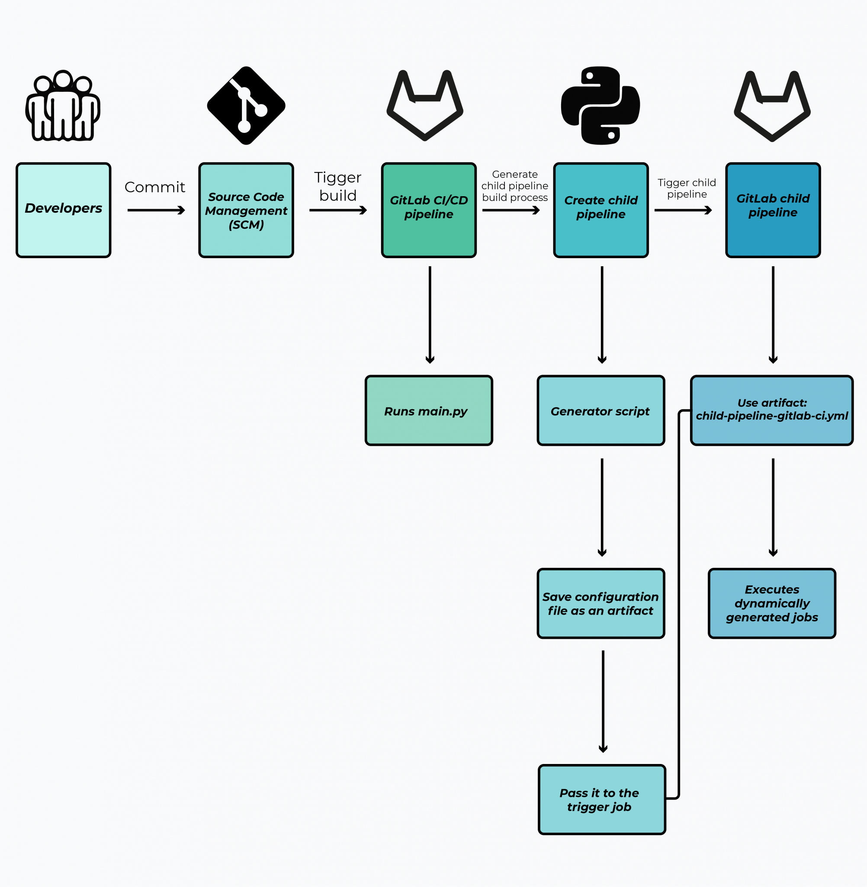
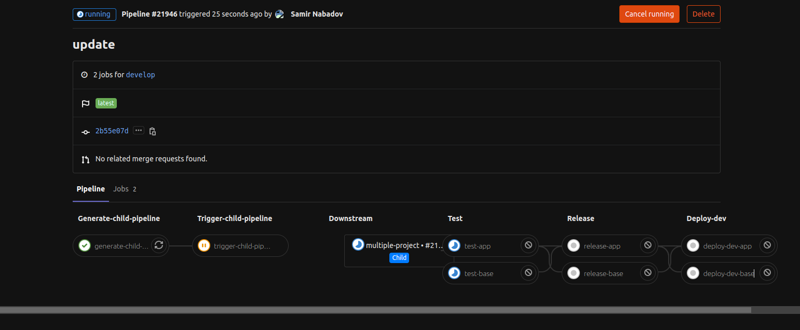

__Dynamic Pipeline Generation__
================================

Generation Dynamic Pipeline on Gitlab

Basic settings
------------
* GitLab CI Pipeline Template
* Helm Charts for deploy to Kubernetes
* Continuous Deployment using Helm
* Python scripts for generation dynamic pipeline
* Using the jib on the gradle to build and push images to gitlab registry (without docker)

Dynamic Pipeline Generation Structure
------------

Note
------------
You can add variables in Gitlab at the group level from Settings -> CICD -> Variables

* CI_GITLAB_USERNAME: cicd_user
* CI_GITLAB_PASSWORD: password
* CI_REGISTRY_USER: registry_user
* CI_REGISTRY_PASSWORD: password
* CI_PROJECT_TEMPLATE: devops/cicd-template-project
* DEV_KUBERNETES_CLUSTER_KUBE_CONFIG: (included dev Cluster kube config)
* PROD_KUBERNETES_CLUSTER_KUBE_CONFIG: (included prod Cluster kube config)

First, the gitlab ci template file is included in the project. There are 2 stages. The first stage is started, a new pipeline file is created based on the python script, then in the next stage the same gitlab ci file is triggered. 

stages:
  - generate-child-pipeline
  - trigger-child-pipeline

The new gitlab ci file has 4 stages. Note that the jobs in the newly created gitlab file are configured according to a multi-project. That is, if there is any change in any project, only jobs belonging to the changed project will be created and executed. Helm Charts for deployments are located in the deploy folder.

tages:
  - test  
  - build
  - deploy-dev
  - deploy-prod

Gitlab pipeline stages
------------

__Requirements__
------------
* Gitlab
* Kubernetes
* Helm
* Python

__Author Information__
------------------

Samir Nabadov
